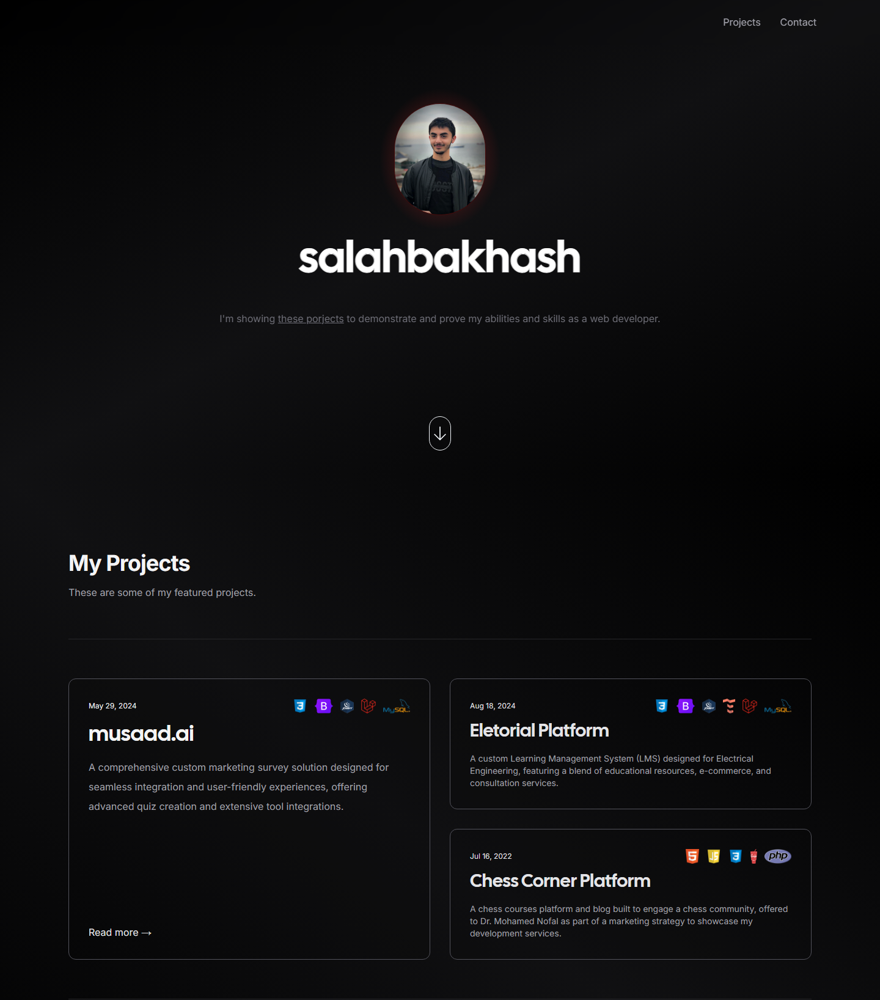

<div align="center">
    <a href="https://salahbakhash.com"><h1 align="center">salahbakhash.com</h1></a>

My personal website, built with [Next.js](https://nextjs.org/), [Tailwind CSS](https://tailwindcss.com/), [Contentlayer](https://www.contentlayer.dev/) and deployed to [Vercel](https://vercel.com/).

<a target="_blank" href="https://my-nextjs-om5uf64t0-salah-2d098c8c.vercel.app/">
    
</a>


</div>

<br/>

## Running Locally

```sh-session
git clone https://github.com/salahWD/my-nextjs-cv.git
cd my-nextjs-cv
```

Then install dependencies and run the development server:

```sh-session
npm install
npm dev
```

## Cloning / Forking

Please remove all of my personal information (projects, images, etc.) before deploying your version of this site.
